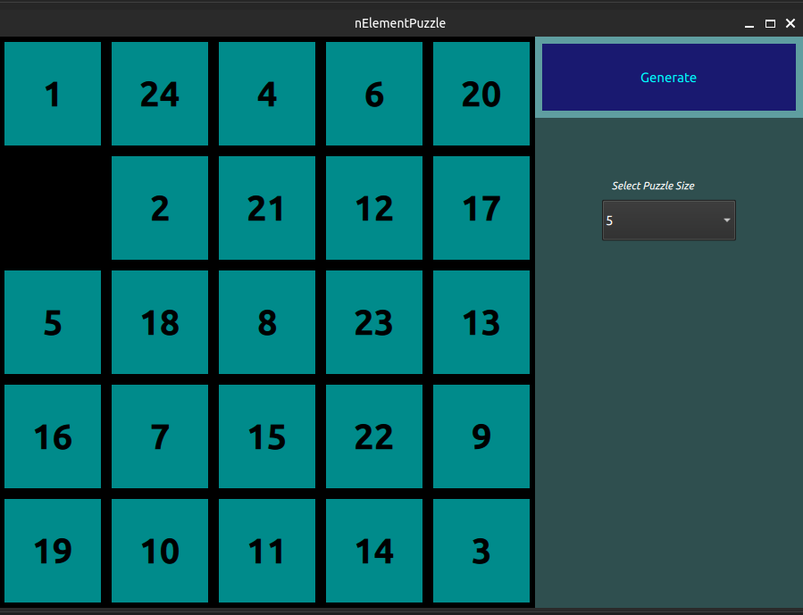

# 🧩 N-Element Puzzle (Qt / QML)

A classic **N-Puzzle sliding game** implemented in **Qt Quick (QML)** with a **JavaScript-based game logic backend**.  
This project represents an **early educational milestone** created after only a few months of learning Qt and QML.



---

## 🎮 Game Rules

- The board consists of **N × N tiles** (configurable from **3×3 to 10×10**).
- One tile is empty (`0`) and acts as a free space.
- A tile can be moved **only if it is directly adjacent** to the empty space.
- Tiles are moved via **mouse interaction / drag & drop**.
- The objective is to arrange tiles in **ascending numerical order**.

---

## 🧠 Architecture Overview

The application follows a **simple and explicit separation between UI and game logic**:

```
QML UI (Qt Quick)
   ↓
JavaScript Game Logic (jsBackEnd.js)
   ↓
Puzzle State, Movement Rules, Board Updates
```

## 🧠 Main Components

### QML UI
- Board rendering using `Repeater`
- Tile layout and positioning
- User interaction (mouse press, drag, release)
- Visual state management (colors, opacity, values)

### JavaScript Backend
- Puzzle generation and randomization
- Coordinate calculation for tiles
- Validation of legal moves
- Tile swapping and board rebuilding
- Centralized game state stored in arrays

### C++ Entry Point
- Minimal Qt application bootstrap
- Loads QML via `QQmlApplicationEngine`
- No game logic implemented in C++

---

## 🛠️ Technologies

- Qt 5 / Qt Quick
- QML
- JavaScript (logic layer)
- CMake
- Qt Resource System (QRC)

---

## ⚠️ Project Status – MVP / Educational

This project is a **finished MVP** and is **not under active development**.

- Created exclusively for educational and portfolio purposes
- Implemented without AI assistance
- Represents an early stage of Qt/QML learning
- Architecture and code style intentionally reflect learning goals
- Some advanced features (e.g. solvability validation, modern MVVM patterns) were deliberately out of scope

Despite this, the project demonstrates:
- practical Qt Quick usage
- real UI–logic separation
- non-trivial interaction and state management
- problem-solving beyond tutorials

---

## 📌 Purpose of This Repository

This repository is kept public as a **learning artifact** —  
a snapshot of real progress made early in the Qt/QML learning journey.
